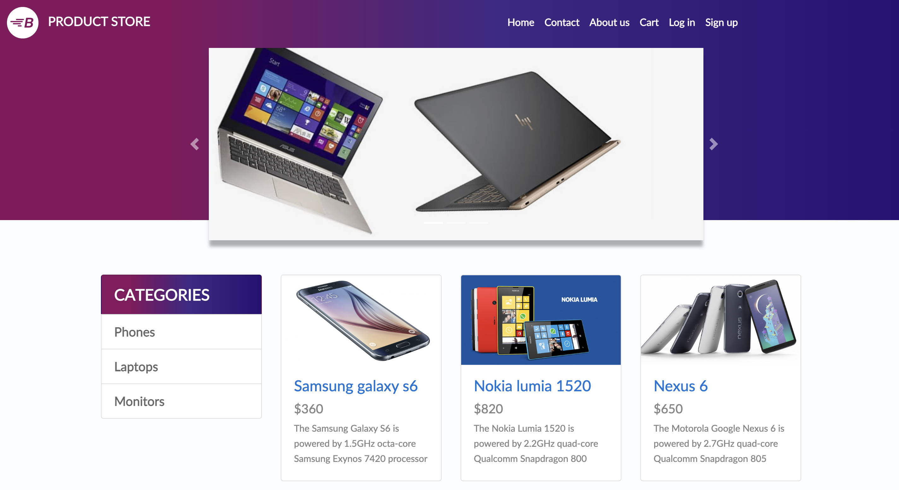
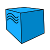
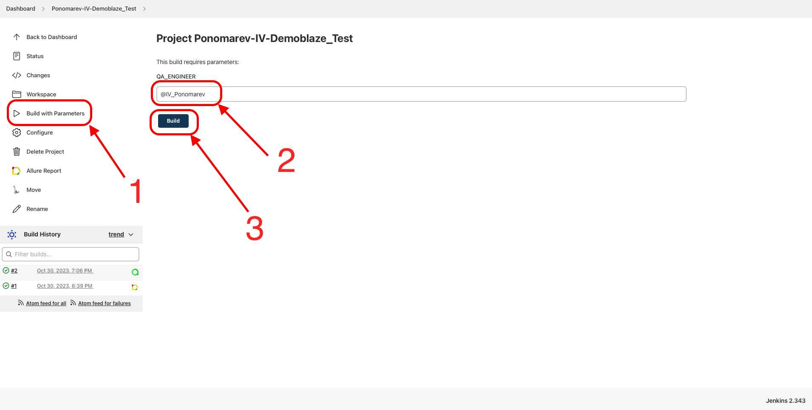
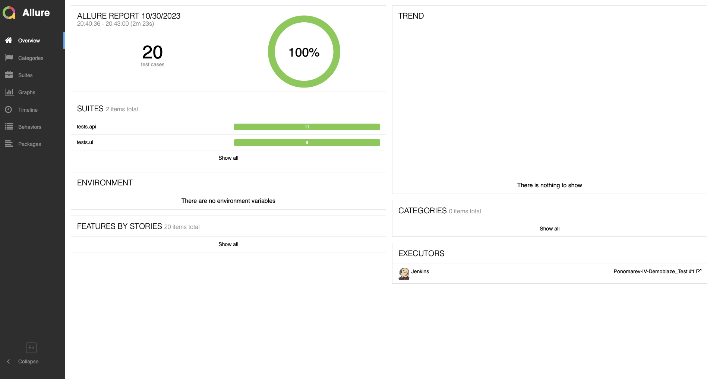
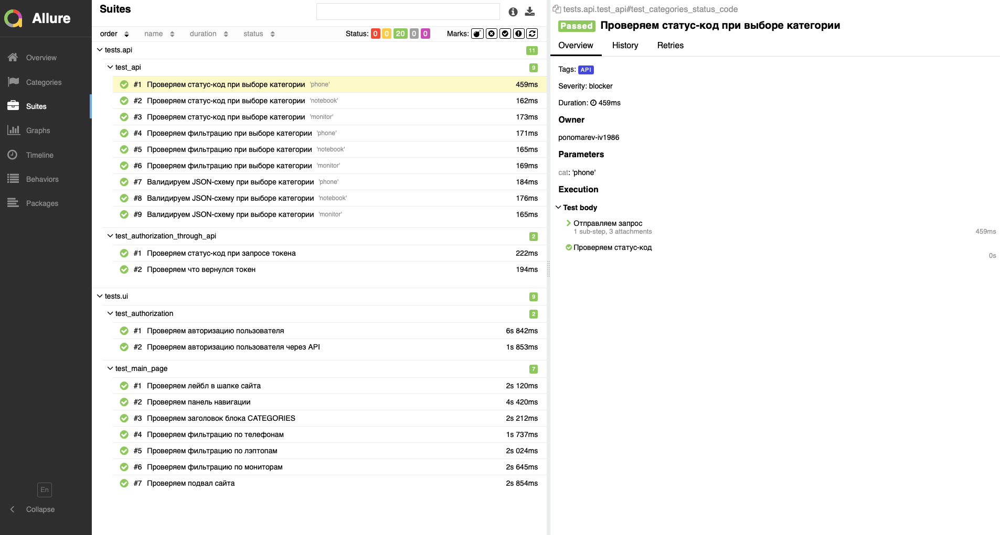
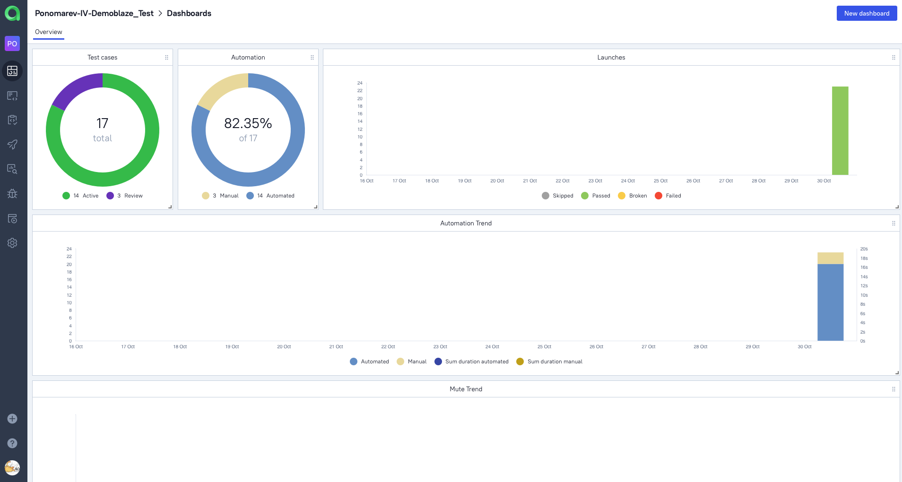
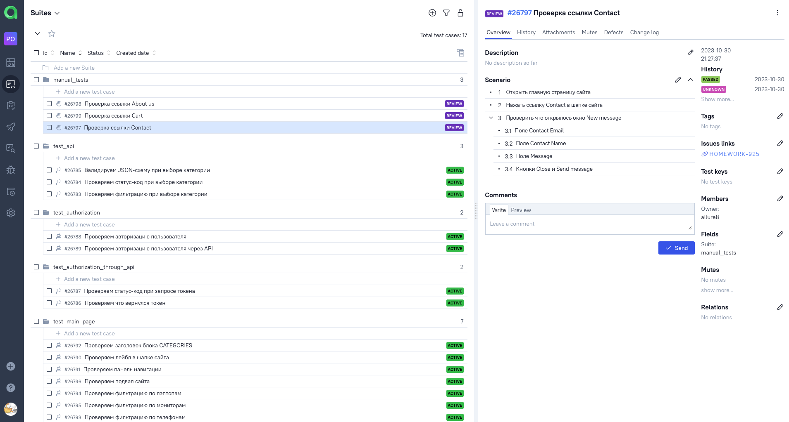
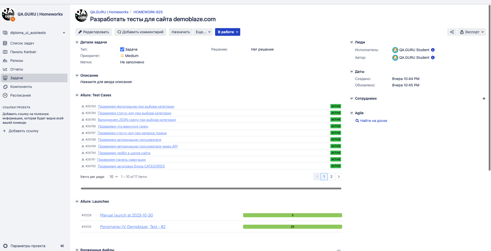
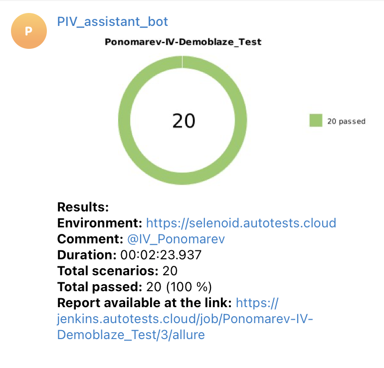

# Демонстрационный проект по тестированию UI и API сайта <a target="_blank" href="https://www.demoblaze.com">"Product Store"</a>

## Стек технологий:

### Запуск автотеста производится удаленно на сервере <a target="_blank" href="https://selenoid.autotests.cloud/#/">Selenoid</a> при помощи написанной в Jenkins <a target="_blank" href="https://jenkins.autotests.cloud/job/Ponomarev-IV-Demoblaze_Test/">джобы</a>.

## Для запуска автотестов необходимо:
- Открыть подготовленную <a target="_blank" href="https://jenkins.autotests.cloud/job/Ponomarev-IV-Demoblaze_Test/">джобу</a> в Jenkins
- Нажать "Build with Parameters" в боковом меню
- Ввести имя тестировщика
- Нажать Build

## После прохождения автотестов можно зайти в Allure Report и посмотреть отчет по тестовому прогону:

## А так же подробно посмотреть результат прохождения каждого отдельного теста:

## Полная статистика по тестовым прогонам, включая ручные тесты, хранятся в <a target="_blank" href="https://allure.autotests.cloud/project/3738/dashboards">Allure TestOps</a>.
### *Главный дашборд Allure TestOps:*

### *Общий список автоматизированных и ручных тест-кейсов проекта:*

### *Запуски автоматизированных и ручных тестов проекта:*

## Тест-кейсы проекта и результаты тестовых прогонов интегрированы с <a target="_blank" href="https://jira.autotests.cloud/browse/HOMEWORK-925">Atlassian Jira</a>.

## Для мгновенного получения результатов о тестировании настроено автоматическое оповещение через Telegram.

## Ниже на видео представлен пример короткого теста на сервере <a target="_blank" href="https://selenoid.autotests.cloud/#/">Selenoid</a>.
