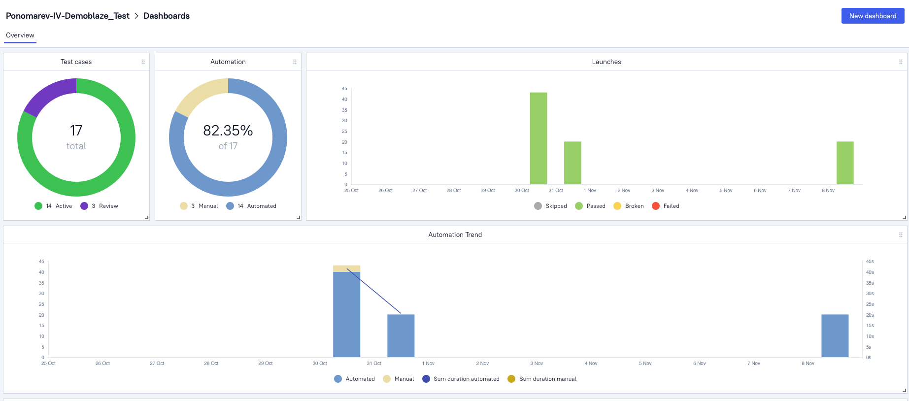

# Демонстрационный проект по тестированию UI и API сайта <a target="_blank" href="https://www.demoblaze.com">"Product Store"</a>


## Стек технологий:


## Для запуска тестов локально необходимо:
Клонировать репозиторий и перейти в него в командной строке:
```
https://github.com/ponomarev-iv1986/demoblaze_test_project.git
```
```
cd demoblaze_test_project
```
Создать и активировать виртуальное окружение:
```
python3 -m venv venv
```
- Если у вас Linux/macOS
    ```
    source venv/bin/activate
    ```
- Если у вас Windows
    ```
    source venv/scripts/activate
    ```
Обновить pip:
```
pip install --upgrade pip
```
Установить зависимости из файла requirements.txt:
```
pip install -r requirements.txt
```
Создать и заполнить .env файл, например:
```
touch .env
```
```
echo ENVIRONMENT='local' >> .env
```
```
echo USER_LOGIN='any_login' >> .env
```
```
echo USER_PASSWORD='any_password' >> .env
```
```
echo API_PASSWORD='any_api_password' >> .env
```
Запустить тесты:
```
pytest .
```

## Для автоматизированного запуска тестов на сервере <a target="_blank" href="https://selenoid.autotests.cloud/#/">Selenoid</a> написана джоба в <a target="_blank" href="https://jenkins.autotests.cloud/job/Ponomarev-IV-Demoblaze_Test/">Jenkins</a>.

### Для запуска автотестов необходимо:
- Открыть подготовленную <a target="_blank" href="https://jenkins.autotests.cloud/job/Ponomarev-IV-Demoblaze_Test/">джобу</a> в Jenkins
- Нажать "Build with Parameters" в боковом меню
- Ввести имя тестировщика
- Нажать Build


## После прохождения автотестов можно зайти в <a target="_blank" href="https://jenkins.autotests.cloud/job/Ponomarev-IV-Demoblaze_Test/5/allure/#">Allure Report</a> и посмотреть отчет по тестовому прогону.


### Так же есть возможность подробно посмотреть результат прохождения каждого отдельного теста, проанализировать шаги, логи теста, просмотреть скриншоты и видео прохождения теста.


## Полная статистика по тестовым прогонам, включая ручные тесты, хранятся в <a target="_blank" href="https://allure.autotests.cloud/project/3738/dashboards">Allure TestOps</a>.
### *Главный дашборд Allure TestOps:*

### *Общий список автоматизированных и ручных тест-кейсов проекта:*

### *Запуски автоматизированных и ручных тестов проекта:*


## Тест-кейсы проекта и результаты тестовых прогонов интегрированы с <a target="_blank" href="https://jira.autotests.cloud/browse/HOMEWORK-925">Atlassian Jira</a> и прилинкованы к соответстующей задаче.


## Для мгновенного получения результатов о тестировании настроено автоматическое оповещение через Telegram.


## Ниже на видео представлен пример короткого теста на сервере <a target="_blank" href="https://selenoid.autotests.cloud/#/">Selenoid</a>.
